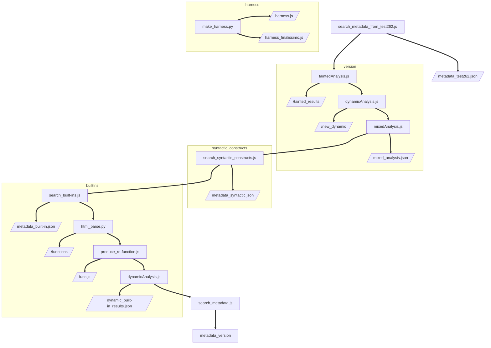

## test
## nodes
Start([start])
End([end])
A[test A]
B(test B)
C[[subrotine]]
D[(database)]
E((circle))
F{diamond}
id1[/output/]
id2[\This is the text in the box\]

```mermaid
flowchart TB

scrape[search_metadata_from_test262.js]
scrape_out[/metadata_test262.json/]
scrape ==> scrape_out

subgraph harness
	make[make_harness.py]
	make ==> har[/harness.js/] & harF[/harness_finalissimo.js/]
end

subgraph version
	taint[taintedAnalysis.js]
	taintOut[//tainted_results/]
	dynamic_version[dynamicAnalysis.js]
	dynamic_versionOut[//new_dynamic/]
	mixed_version[mixedAnalysis.js]
	mixed_versionOut[/mixed_analysis.json/]

	taint ==> taintOut & dynamic_version
	dynamic_version ==> mixed_version & dynamic_versionOut
	mixed_version ==> mixed_versionOut
end

scrape ==> taint

subgraph syntactic_constructs
	syntac[search_syntactic_constructs.js]
	syntacOut[/metadata_syntactic.json/]

	syntac ==> syntacOut
end

mixed_version ==> syntac

subgraph builtIns
	static_builtIn[search_built-ins.js]
	static_builtInOut[/metadata_built-in.json/]
	html[html_parse.py]
	htmlOut[//functions/]
	wrap[produce_re-function.js]
	wrapOut[/func.js/]
	dynamic_builtIn[dynamicAnalysis.js]
	dynamic_builtInOut[/dynamic_built-in_results.json/]

	static_builtIn ==> static_builtInOut & html
	html ==> htmlOut & wrap
	wrap ==> wrapOut & dynamic_builtIn
	dynamic_builtIn ==> dynamic_builtInOut
end

syntac ==> static_builtIn

dynamic_builtIn ==> final[search_metadata.js]
final ==> finalOut[metadata_version]
```
